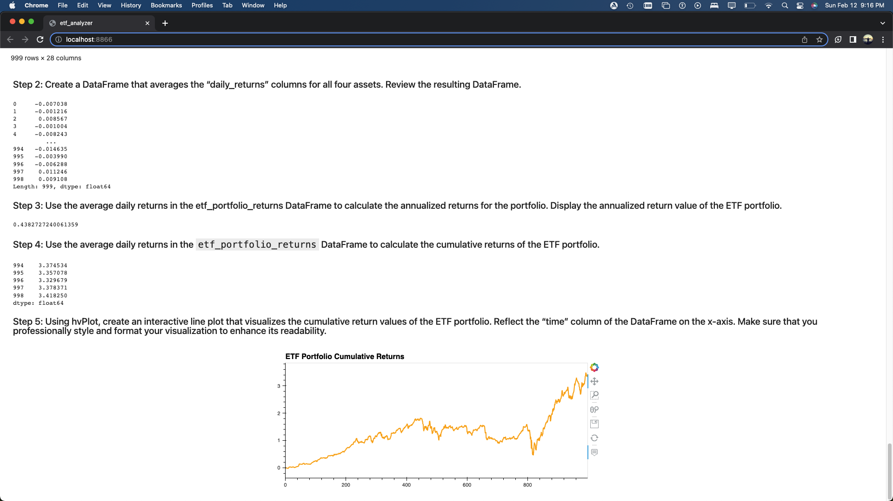

# ETF Portfolio Analysis
This project uses Python, SQL, and the Voila library to develop a financial database and a web application to analyze the returns of four ETF Portfolios: GDOT, PYPL, GS, and SQ.
# Getting Sarted 
Download tools required for this Analyzer and confirm downloads
- SQLAlchemy 

`pip install SQLAlchemy`

`conda list sqlalchemy`
- Voila

`conda install -c conda-forge voila
`

`conda list voila`
# Data Collection
The data for this analysis was obtained from  the etf.db file in this folder.

# Libraries
`import numpy as np`

`import pandas as pd`

`import hvplot.pandas`

`import sqlalchemy`

`import warnings`
##### "import warnings" is used to ignore random warnings from cells, this will not affect the code. 
`warnings.filterwarnings("ignore")`

# Sources
[AskBCS Learning Assistant](https://slack.com/)

[Bootcamp Spot](https://courses.bootcampspot.com/courses/2916/assignments/47569?module_item_id=871830)

[Google](https://www.google.com/)

# Voila Screenshot
- "Voilà accepts a path to the notebook and then generates a web app with any visualizations or output that were generated in the Jupyter notebook."- [Bootcamp Spot](https://courses.bootcampspot.com/courses/2916/pages/7-dot-3-5-building-web-applications-via-crud-operations?module_item_id=871828) 

To generate this webpage. 

1. Open Terminal in MacOS
2. use `cd <folder_name>`
3. use `ls` and confirm "etf_analyzer.ipynb" is in designated folder
4. Enable virtual enviroment
5. Type `voila etf_analyzer.ipynb` 

